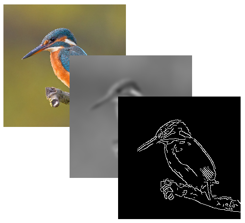
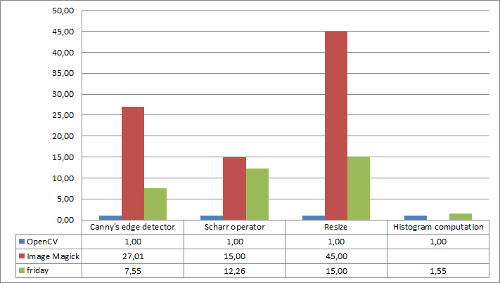

*friday* is an image processing framework for Haskell. It has been designed to
build fast, generic and type-safe image processing algorithms.

*friday* also provide some simple computer vision features such as edge
detection or histogram processing.

Except for I/Os, *friday* is entirely written in Haskell.



# Features

The four distinguishing features of this image library are:

* A reliance on a strongly typed programming language to detect programming
  errors directly at compile time.
* The ability to fuse image transformations.
  For example, if one wishes to apply a rotation on a resized image, he can
  use *friday* and the *Haskell* compiler to generate a single loop that will
  automatically combine the resizing and the rotating operations into a single
  algorithm, removing the need to store the intermediate resized image.
* The ability to automatically parallelize algorithms to use multiple
  processors.
  The library is able to parallelize upon request image transformations, even
  these which have been generated by the fusion mechanism.
* Being extremely generic. One who wants to create new algorithms, new
  pixel color-spaces or new ways to store an image will be able to reuse the 
  advanced type checking features and both the fusion and automatic
  parallelization mechanisms.

The library is more like a set of *building blocks to write image processing
algorithms in a functional programming style* than a collection of image
processing algorithms.

The library currently supports four color-spaces: RGB, RGBA, HSV and gray-scale
images. Images can be converted between these color-spaces.

At this moment, the following features and algorithms have been implemented:

* various image transformations: resizing, cropping, vertical and horizontal
[flop/flipping](http://en.wikipedia.org/wiki/Flopped_image) and
[flood fill](http://en.wikipedia.org/wiki/Flood_filling) ;

* filters:
[morphological transformations](http://en.wikipedia.org/wiki/Mathematical_morphology)
(dilation and erosion), blurring (mean
and [Gaussian](http://en.wikipedia.org/wiki/Gaussian_blur) blurs) and
derivative computation
([Sobel](http://en.wikipedia.org/wiki/Sobel_operator) and
[Scharr](http://en.wikipedia.org/wiki/Sobel_operator#Alternative_operators)
operators) ;

* support for mutable and masked images ;

* non-adaptive, adaptive, Otsu and SCW thresholding methods ;

* edge detection using
[Canny's algorithm](http://en.wikipedia.org/wiki/Canny_edge_detector) ;

* color histograms (including comparisons and image equalization).

# Quick tour

## Modules

The library is divided in three main modules: `Vision.Primitive`, `Vision.Image`
and `Vision.Histogram`.

You can directly import sub-modules (such as `Vision.Image.Transform`), but the
backward-compatibility is *not* enforced. That is, some functions could be moved
to another sub-module in a newer backward-compatible advertised version.

### Vision.Primitive

`Vision.Primitive` contains types used all over the library, such as `Shape`
which is used to define shapes and indices in images and histograms.

The module is usually imported unqualified:

```haskell
import Vision.Primitive
```

### Vision.Image

`Vision.Image` contains functions and types to manage and transform images.

The module can be imported unqualified but it's often better use a qualified
import as some function names (such as `map`) can conflict with `Prelude` and
`Vision.Histogram`:

```haskell
import Vision.Image
-- or
import qualified Vision.Image as I
```

### Vision.Histogram

`Vision.Histogram` contains functions and types to create and compare
histograms.

The module can be imported unqualified but it's often better use a qualified
import as some function names (such as `map`) can conflict with `Prelude` and
`Vision.Image`:

```haskell
import Vision.Histogram
-- or
import qualified Vision.Histogram as H
```

## The Image type-class

Images implement the `Image` type-class.

This type-class give you, among other things, the `index` and the `shape`
methods to look up for pixel values and to get the image size.

## Manifest and Delayed images

To benefit from Haskell's purity, non-mutable images are represented in two
ways:

* the `Manifest` representation stores images in Haskell `Vector`s. `Grey`,
`HSV`, `RGB` and `RGBA` are *manifest* images ;

* the `Delayed` representation uses a function to produce image pixels. These
images can be efficiently chained to produce complex transformations. With some
inlining, Haskell compilers are able to produce fast algorithms by removing
intermediate structures when working with delayed images.
`GreyDelayed`, `HSVDelayed`, `RGBDelayed` and `RGBADelayed` are *delayed*
images.

The `convert` method from the `convertible` package can be used to convert
images between color-spaces and representations.

As most functions work with both representations and all color-spaces, you need
to help the type checker to choose the correct return type.

For example, if you want to convert an RGBA image to a greyscale image, use a
type annotation to inform the compiler the image type you want to get:

```haskell
toGrey :: RGBA -> Grey
toGrey = convert
```

When you only need to force the returned representation of a function, you can
use the `delayed` and `manifest` functions. These functions don't do anything
except enforcing types.

```haskell
makeMiniature = delayed . resize Bilinear (ix2 150 150)
```

See
[this file](https://github.com/RaphaelJ/friday-examples/blob/master/src/Delayed.hs)
for an example of a pipeline of delayed images.

## Masked images

Some images are not defined for each of their pixels. These are called masked
images and implement the `MaskedImage` type-class.

The `MaskedImage` type-class primarily gives you a `maskedIndex` method which
differs from `index` by its type :

```haskell
index       :: Image i       => i -> Point -> ImagePixel i
maskedIndex :: MaskedImage i => i -> Point -> Maybe (ImagePixel i)
```

Unlike `index`, `maskedIndex` doesn't always return a value. For convenience,
every `Image` instance is also a `MaskedImage` instance.

`DelayedMask` can be used to create a masked image.

## Create images from functions

Images are instance of the `FromFunction` type-class. This class provide a
method to create images from a function.

For example, if you want to create a black and white image from another image,
you could write:

```haskell
toBlackAndWhite :: (Image i, Convertible i Grey) => i -> Grey
toBlackAndWhite img =
    let grey = convert img :: Grey
    in fromFunction (shape img) $ \pt ->
            if grey `index` pt > 127 then 255
                                     else 0
```

However, most of the time, you will prefer to use the `map` function instead:

```haskell
toBlackAndWhite :: (Image i, Convertible i Grey) => i -> Grey
toBlackAndWhite img =
    let grey = convert img :: Grey
    in map (\pix -> if pix > 127 then 255 else 0) grey
```

## Load and save images from and to files

For modularity, storage operations are provided by separate packages.

The *[friday-devil](https://hackage.haskell.org/package/friday-devil)* package
provides FFI calls to the *DevIL* image library. The library is written in C and
supports a wide variety of image formats, including BMP, JPG, PNG, GIF, ICO and
PSD.

The popular *[JuicyPixels](https://hackage.haskell.org/package/JuicyPixels)*
package is a native Haskell library for decoding many image types.  Efficient,
zero copy, conversion between JuicyPixels and Friday Haskell types is provided
by
*[friday-juicypixels](http://hackage.haskell.org/package/friday-juicypixels)*.

# Examples

See the *[friday-examples](https://github.com/RaphaelJ/friday-examples)*
package for a set of examples.

# Benchmarks

The library has been sightly optimized and could be moderately used for
real-time applications.

The following graph shows how the library compares to two other image processing
libraries written in C. The fastest implementation for each algorithm is taken
as reference:



The main reason that performances are currently below OpenCV is that OpenCV
relies heavily on SIMD instructions.
